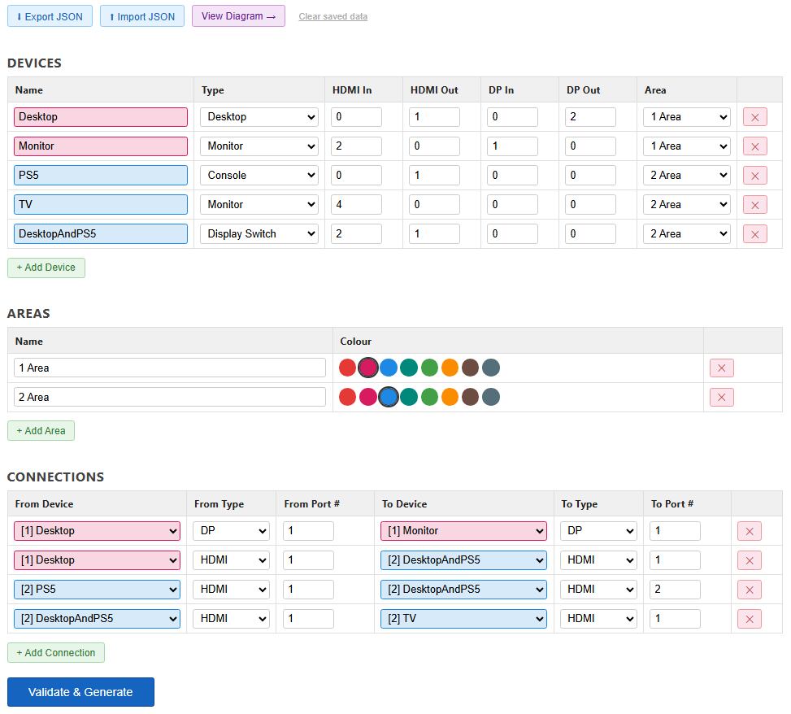
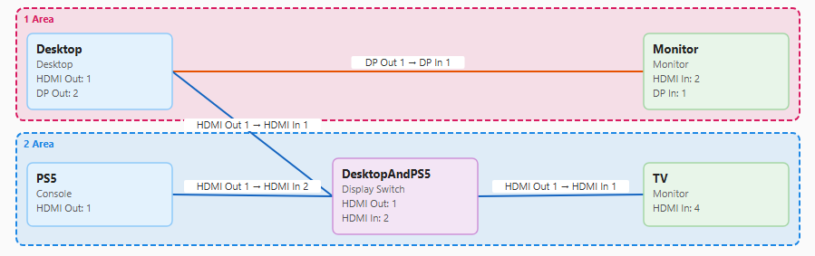
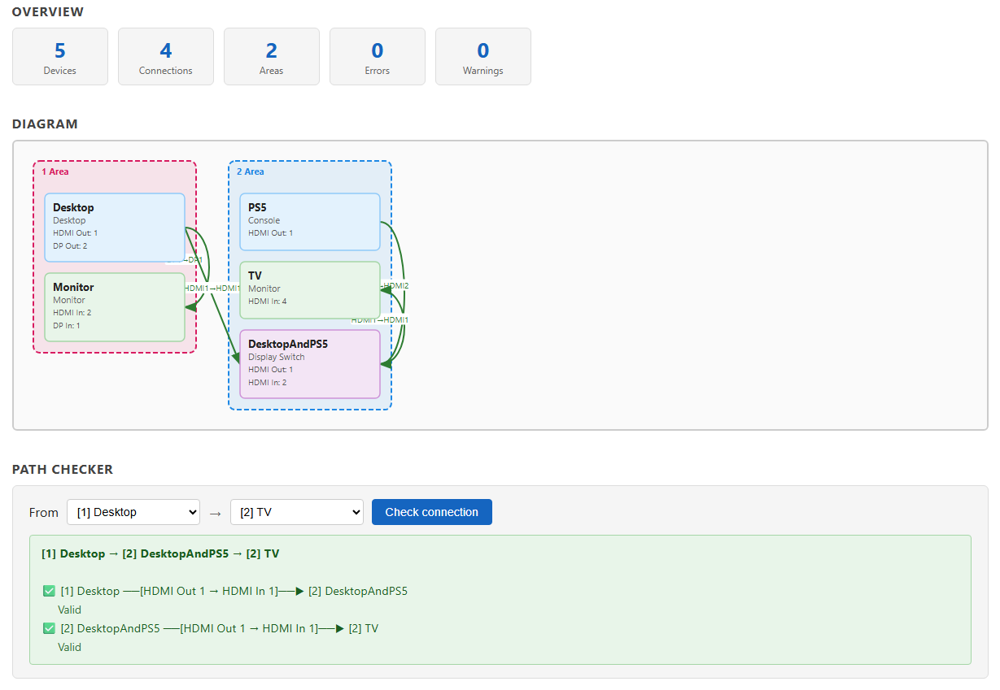

# Home Media Device Planner

Plan, visualize, and validate your home AV / media device setup — no install, no server, no build tools.

**[Live Demo](https://yongwoon123.github.io/home-media-device-planner)**

---

## Screenshots

| Planner | Visualizer |
|---|---|
|  |  |



---

## Features

### Planner (`index.html`)
- Add devices: Console, Desktop, Laptop, Monitor, Display Switch, KVM Switch, Extension
- Set HDMI and DisplayPort in/out counts per device
- Define connections between devices with port type and port number
- Validate connections — port overuse errors, unassigned warnings
- Group devices by room/area with color coding
- Sort devices by name, type, or area
- Generate a procurement list (cables, switches) from your setup
- Generate a shopping list prompt ready to paste into an AI assistant
- Export/import your setup as JSON
- Auto-saves to browser localStorage — your setup persists across sessions

### Visualizer (`visualizer.html`)
- Auto-loads from the Planner via localStorage — just click "View Diagram →"
- Or paste / upload any exported JSON manually
- SVG diagram: areas as columns, devices as nodes, connections as labeled arrows
- Path checker: pick any two devices and find the signal path (BFS, up to 10 hops)
- Connections table with status, port details, and validation notes

---

## How to Use

### Option 1 — Live demo (no download)
Open the [live demo](https://yongwoon123.github.io/home-media-device-planner) in any modern browser. Nothing to install.

### Option 2 — Run locally
1. Download `index.html` and `visualizer.html`
2. Open `index.html` in any modern browser
3. No server required — both files work from the filesystem (`file://`)

---

## JSON Export Format

The planner exports (and the visualizer accepts) a JSON file with this shape:

```json
{
  "devices": [
    {
      "id": 1,
      "name": "Desktop",
      "type": "Desktop",
      "hdmiIn": 0, "hdmiOut": 1,
      "dpIn": 0,   "dpOut": 2,
      "areaId": 1
    }
  ],
  "connections": [
    {
      "id": 1,
      "fromDeviceId": 1, "fromPortType": "DP", "fromPortNum": 1,
      "toDeviceId": 2,   "toPortType": "DP",   "toPortNum": 1
    }
  ],
  "areas": [
    { "id": 1, "name": "Gaming Desk", "color": "#1e88e5" }
  ],
  "deviceCounter": 5,
  "connectionCounter": 4,
  "areaCounter": 2
}
```

See `sample.json` for a complete example.

**Device types:** `Console` · `Desktop` · `Laptop` · `Monitor` · `Display Switch` · `KVM Switch` · `Extension`

**Port types:** `HDMI` · `DP` (DisplayPort)

---

## License

MIT — see [LICENSE](LICENSE).
